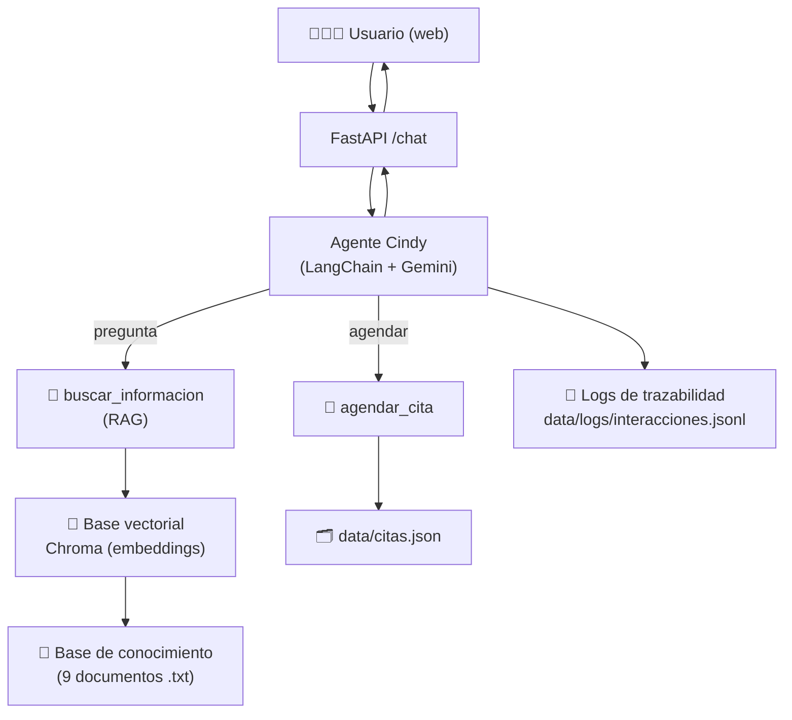
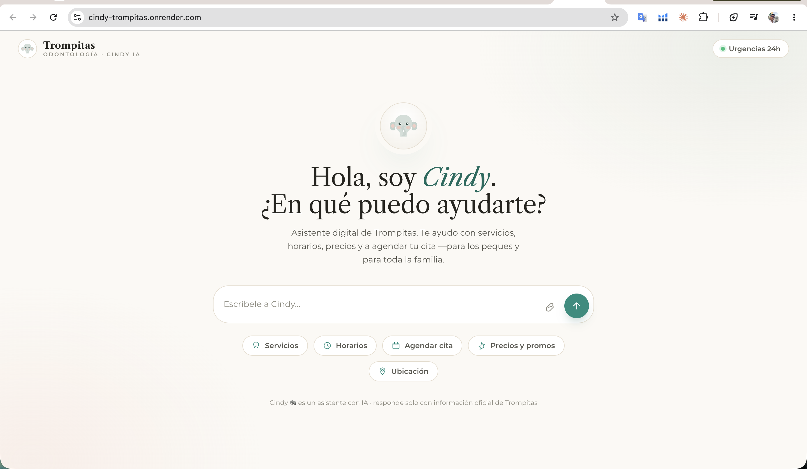
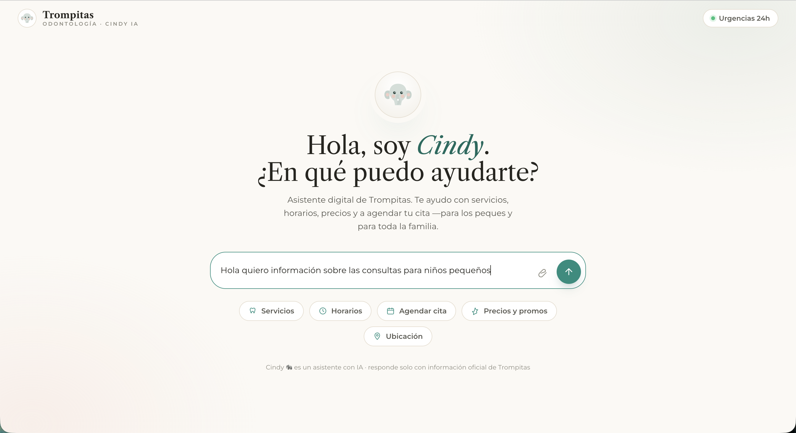
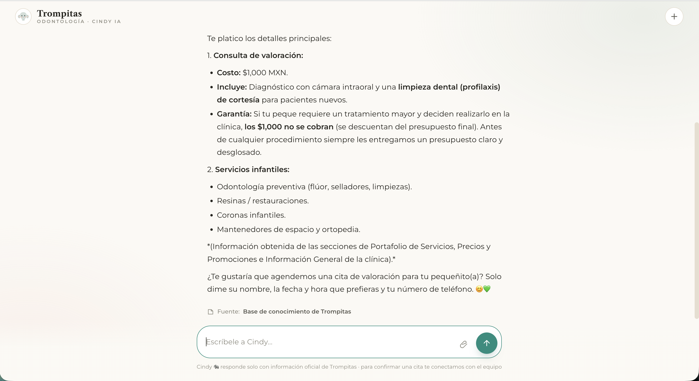
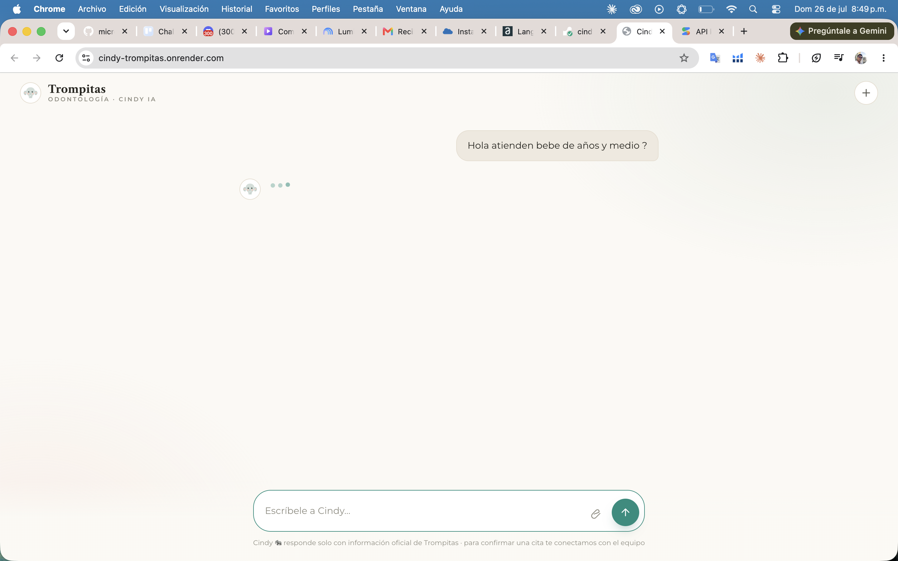
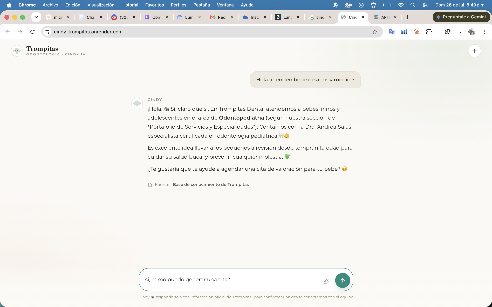
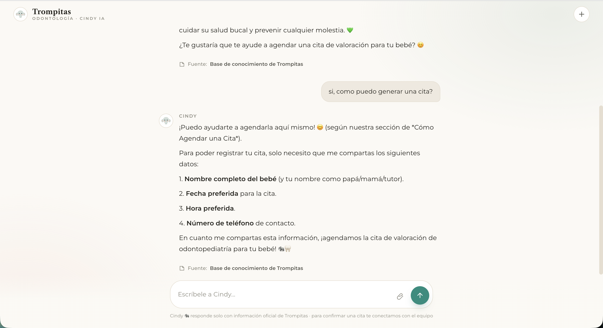
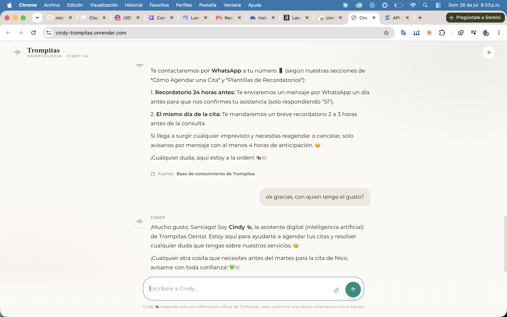

# 🐘 Cindy — Asistente IA de Trompitas Dental

Chatbot corporativo con **RAG** (Retrieval-Augmented Generation) y **agente con herramientas** para la clínica de odontopediatría **Trompitas Dental** (San Juan del Río, Querétaro).
Cindy responde dudas de pacientes usando **únicamente** la información oficial de la clínica (sin alucinar, citando la fuente) y **agenda citas** dentro del propio chat.

🔗 **App en vivo:** https://cindy-trompitas.onrender.com

---

## 🎓 Sobre el Challenge

Este proyecto forma parte del **Challenge AlurAgente**, del programa **Oracle Next Education (ONE)** de **Alura Latam** — formación en **Orquestación de Agentes IA**.
El objetivo del challenge es construir un agente corporativo con RAG, desplegado en **Oracle Cloud Infrastructure (OCI)** y accesible mediante una URL pública.

---

## ✨ Características

- 💬 **Responde con IA** sobre servicios, precios, horarios, ubicación, políticas y urgencias.
- 📚 **RAG con citación de fuentes**: solo responde con la base de conocimiento oficial.
- 🚫 **Anti-alucinación**: si el dato no está, lo dice y ofrece contacto humano (WhatsApp).
- 📅 **Agenda citas** (herramienta del agente) con persistencia.
- 🐘 **Personalidad propia** (Cindy) y se identifica siempre como asistente digital (IA).
- 📝 **Trazabilidad**: registra cada interacción (pregunta, respuesta, herramienta) para auditoría.
- 🎨 **Interfaz web propia** (no genérica), cálida y responsiva.

---

## 🧠 Arquitectura



**Flujo:** el usuario escribe → el agente decide si **responder** (busca en la base vectorial con RAG y redacta con Gemini, citando la fuente) o **agendar** (herramienta que registra la cita). Cada interacción se guarda en el log.

---

## 🛠️ Tecnologías

| Componente | Tecnología |
|---|---|
| Lenguaje | Python 3.12 |
| Orquestación de agentes | LangChain |
| LLM | Google Gemini (`gemini-flash-latest`) |
| Embeddings | Google Gemini (`gemini-embedding-001`) |
| Base vectorial | ChromaDB (persistente) |
| Backend web | FastAPI + Uvicorn |
| Frontend | HTML + CSS + JavaScript (sin frameworks) |
| Contenedor / Deploy | Docker · Oracle Cloud Infrastructure (OCI) |

---

## 📁 Estructura del proyecto

```
Trompitas Agent/
├── base_conocimiento/     # 9 documentos .txt (info oficial de la clínica) + índice
├── src/
│   ├── config.py          # modelos, rutas y parámetros
│   ├── ingest.py          # Paso 3: chunking + embeddings → Chroma
│   ├── rag.py             # Paso 4: cadena RAG (retriever + Gemini)
│   ├── prompts.py         # personalidad y reglas de Cindy
│   ├── tools.py           # herramientas: buscar_informacion, agendar_cita
│   ├── agent.py           # Paso 5: agente + trazabilidad (logs)
│   └── api.py             # Paso 6: backend FastAPI (sirve la web + /chat)
├── web/
│   └── index.html         # interfaz web de Cindy
├── data/                  # base vectorial, citas y logs (generados)
├── requirements.txt
├── Dockerfile · start.sh · .env.example
```

---

## 🚀 Instalación y uso (local)

**Requisitos:** Python 3.12 y una API key de Google AI Studio (Gemini).

```bash
# 1. Entorno e instalación
python3.12 -m venv .venv
source .venv/bin/activate
pip install -r requirements.txt

# 2. Configura tu clave (copia .env.example a .env y pon tu clave)
#    GOOGLE_API_KEY=tu_clave

# 3. Construye la base vectorial (indexación)
cd src && python ingest.py

# 4. Levanta la interfaz web
../.venv/bin/uvicorn api:app --host 0.0.0.0 --port 8000
```

Abre **http://localhost:8000** 🐘

> También puedes probar en terminal: `python agent.py "¿cuánto cuesta la consulta?"`

### Configuración (`.env`)

```env
GOOGLE_API_KEY=tu_clave_de_google_ai_studio
```

---

## 💬 Ejemplos de preguntas y respuestas

**P: ¿Cuánto cuesta la consulta?**
> La consulta base cuesta **$1,000 MXN** e incluye diagnóstico con cámara intraoral y limpieza de cortesía. Si decides realizar un tratamiento con nosotros, la consulta **no se cobra** (se descuenta del presupuesto). *Fuente: Precios y Promociones.*

**P: ¿Qué horarios manejan para niños?**
> Odontopediatría: **L–V** 9:00–14:00 y 16:00–20:00 · **Sábados** 10:00–14:00 · **Domingos** solo urgencias. *Fuente: Horarios de Atención.*

**P: ¿Aceptan seguros de gastos médicos?** *(dato que NO está en la base)*
> Eso no lo tengo con certeza, permíteme corroborar la información. Puedes escribirnos por WhatsApp al **+52 427 335 1918**. *(No inventa el dato.)*

**Agendar:** "Quiero agendar para mi hija Sofía el martes a las 5pm, una limpieza. Tel 427…" → Cindy registra la cita y confirma.

---

## 📝 Trazabilidad (auditoría)

Cada interacción se guarda en `data/logs/interacciones.jsonl`:

```json
{"timestamp":"2026-07-26T03:41:03","pregunta":"¿cuánto cuesta la consulta?","respuesta":"...","herramientas_usadas":["buscar_informacion"]}
```

---

## ☁️ Despliegue en la nube

La aplicación está desplegada como **contenedor Docker** y accesible públicamente:

**🔗 https://cindy-trompitas.onrender.com**

El despliegue usa el `Dockerfile` del proyecto: al arrancar, construye la base vectorial
(si no existe) y levanta el servidor web (`start.sh`). La única variable requerida es
`GOOGLE_API_KEY`, configurada como variable de entorno en la plataforma.

```bash
# Reproducible en cualquier host con Docker:
docker build -t cindy-trompitas .
docker run -d -p 8000:8000 -e GOOGLE_API_KEY="tu_clave" cindy-trompitas
```

---

## 📸 Evidencias

Aplicación **en vivo** y funcionando en la URL pública, con la interfaz de Cindy:



El usuario pregunta en lenguaje natural sobre las consultas para niños:



Cindy responde con precios y servicios reales, **citando la fuente** (base de conocimiento de la clínica):



Otra consulta ("¿atienden bebés?"), con el indicador de "escribiendo":



Respuesta sobre odontopediatría (Dra. Andrea Salas), nuevamente con la fuente citada:



Flujo de **agendamiento** dentro del chat: Cindy solicita los datos para registrar la cita:



Recordatorios, políticas y Cindy **identificándose como asistente digital (IA)**:



---

## 🔜 Próximas iteraciones

- 📆 Integración real con **Google Calendar** (disponibilidad y creación de eventos).
- 💬 Conversación por **WhatsApp** (WhatsApp Business API).

---

## 👤 Autor

**Santiago Hernández** — Challenge AlurAgente (Orquestación de Agentes IA).
